# Hướng dẫn thêm sửa xóa
## 1. Trang Home
#### A. PhầnSlider
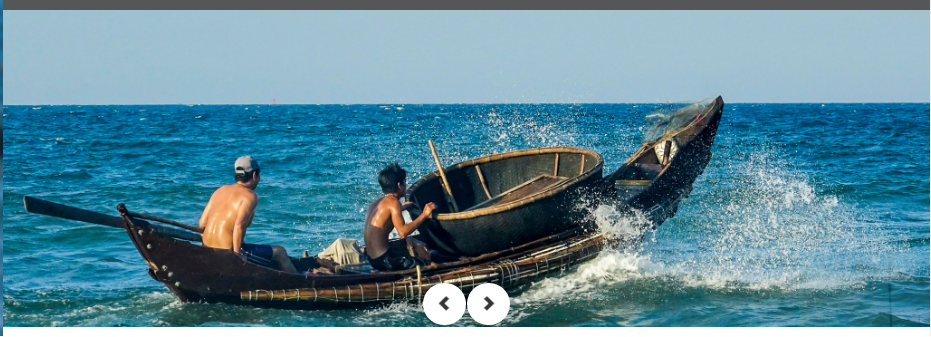 
Bước 1: Chuẩn bị hình ảnh thay thế. 
Bước 2: Vào đường dẫn  **Tên-web-site\user\pages\01.home\_slider** 
Bước 3: Thay thế bằng hình ảnh muốn hiển thị. 
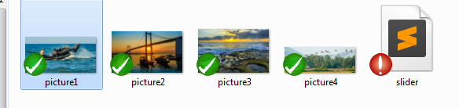 
Thay đổi tên và thứ tự hiển thị **_picture1_** đến **_picture4_**   

#### B. Phần thể loại(categories) 
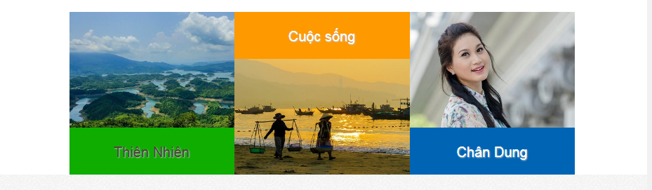 
Bước 1: Chuẩn bị hình ảnh thay thế. 
Bước 2: Vào đường dẫn **Tên-web-site\user\pages\01.home\_categories** 
Bước 3: Thay thế bằng hình ảnh muốn hiển thị. 
Mở file categories.md 
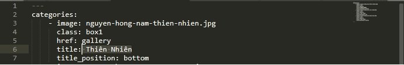 
        - image:**_ thay bằng tên ảnh mới mà bạn cần._ **
          class:**_ không được thay đổi _** 
          href: **_ không được thay đổi_** 
          title: **_ Thay tên tiêu đề bạn muốn hiển thị_** 
          title_position:  **_Nhận 2 giá trị top / botom) _**     
          
          
#### C. Phần chân trang( footer) 
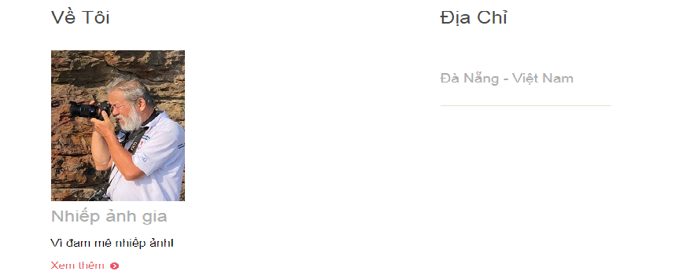 
Bước 1: Chuẩn bị hình ảnh thay thế. 
Bước 2: Vào đường dẫn **Tên-web-site\user\pages\01.home\_footer** 
Bước 3: Thay thế bằng hình ảnh/ nội dung muốn hiển thị. 
Mở file footer.md 
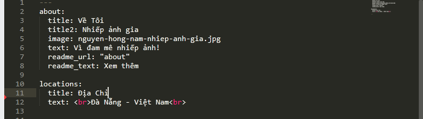 
              title: **_ Tiêu đề _ **
              title2: **_ Nghề nghiệp _ **
              image: **_  link ảnh _ **
              text:	**_ slogan của bạn _ **
              readme_url:  **_ Không được thay đổi _ **
              readme_text:  **_(Không được thay đổi  _ **
        locations: 
              title:  **_  Tiêu đề _ **
              text:  **_  Thay địa chỉ mới vào đây _**   
              
              
####  D. Phần danh mục ( portfolio) 
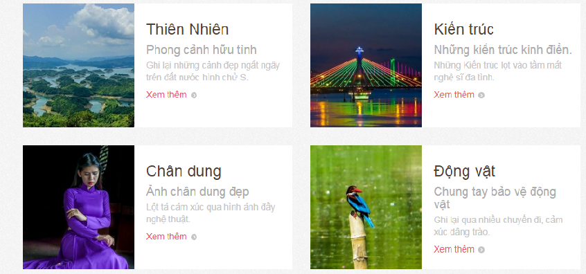 
Bước 1: Chuẩn bị hình ảnh thay thế. 
Bước 2: Vào đường dẫn **Tên-web-site\user\pages\01.home\_portfolio** 
Bước 3: Thay thế bằng hình ảnh/ nội dung muốn hiển thị. 
Mở file portfolio.md 
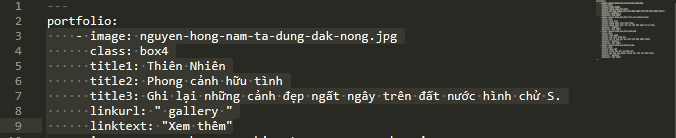 
            - image:**_  link ảnh _ **
              class:** _  Không được thay đổi _ **
              title1: **_ Thay tên tiêu đề bạn muốn hiển thị _ **
              title2: **_Thay tên tiêu đề bạn muốn hiển thị _ **
              title3: **_Thay tên nội dung bạn muốn hiển thị _ **
              linkurl: 	**_ link mở trang _ **
              linktext: **_ Tên link _   **

## 2. Trang Abount me 
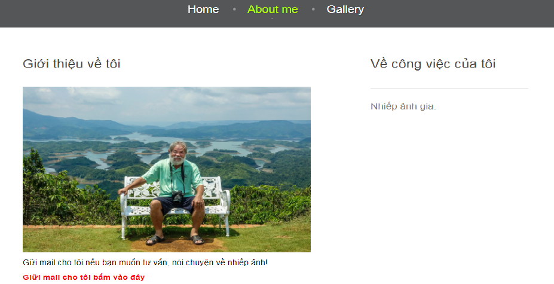 
Bước 1: Chuẩn bị hình ảnh thay thế. 
Bước 2: Vào đường dẫn **Tên-web-site\user\pages\02.about\about** 
Bước 3: Thay thế bằng hình ảnh/ nội dung muốn hiển thị. 
Mở file about.md 
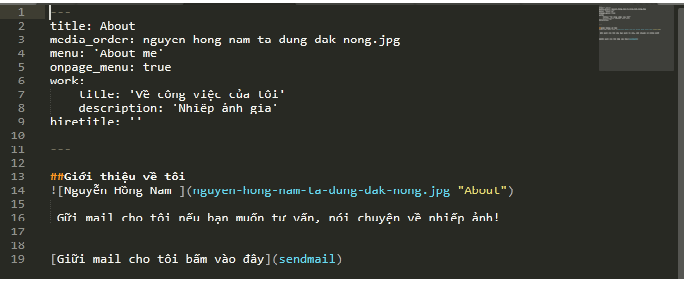 
                title: **_  Không nên thay đổi _ **
                media_order: **_  link ảnh _ **
                menu: **_  Không nên thay đổi _ **
                onpage_menu: true 
                work: 
                    title: **_ Thay tên tiêu đề bạn muốn hiển thị _ **
                    description: **_ Thay tên bạn muốn hiển thị _ **
                    hiretitle:  ' ' 
                --- 
                

## 4. Trang Gallery
 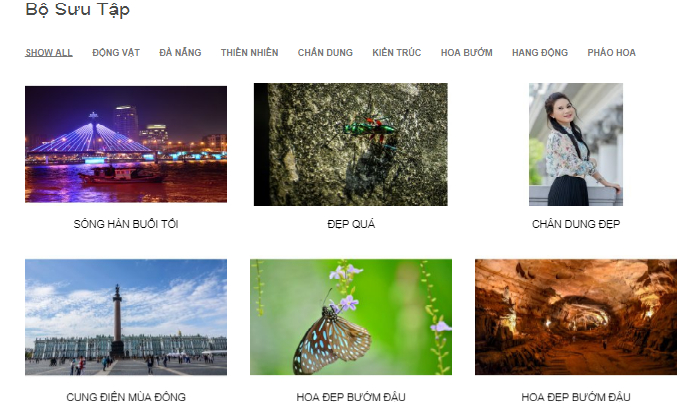 
Bước 1: Chuẩn bị hình ảnh thay thế. 
Bước 2: Vào đường dẫn **Tên-web-site\user\pages\03.galleryt\gallery** 
Bước 3: Thay thế bằng hình ảnh/ nội dung muốn hiển thị. 
Mở file gallery.md 
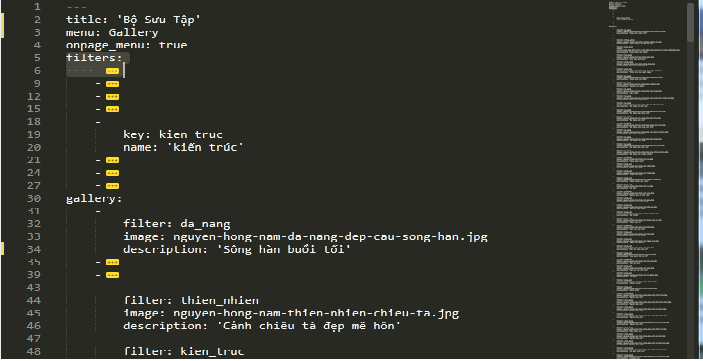 
                    --- 
                    title: **_Không thay đổi_ **
                    menu: **_Không thay đổi_ **
                    onpage_menu: true :**_Không thay đổi_ **
                    filters:  
                        - 
                            key:   **_Key  album  _ **
                            name:  **_Tên album_ **
                     gallery: 
                        - 
                            filter:  **_Key album_ **
                            image:   **_ Link ảnh_ **
                            description:   **_ Nội dung ảnh_ **